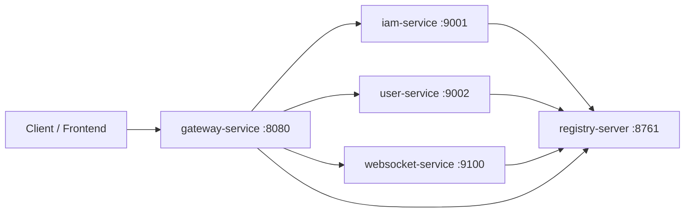

# YoungPlace 微服务项目说明

## 1. 项目概览

YoungPlace 是一个基于 **Spring Boot + Spring Cloud** 的 Maven 多模块微服务项目，当前目标是沉淀一套可扩展的基础服务框架，覆盖服务注册、网关转发、单点登录（SSO）、用户查询与实时通信能力。

- 运行环境：`JDK 8`
- 构建方式：`Maven` 多模块聚合工程
- 核心框架：`Spring Boot 2.3.12.RELEASE`、`Spring Cloud Hoxton.SR12`
- 当前形态：可运行的微服务闭环（Registry + Gateway + IAM + User + WebSocket）

---

## 2. 技术架构信息

### 2.1 分层与调用关系



### 2.2 模块结构与职责

| 模块 | 类型 | 核心职责 | 状态 |
|---|---|---|---|
| `ev-common` | 公共库 | 提供统一响应结构 `ApiResponse<T>` | 已实现 |
| `ev-registry` | 基础服务 | Eureka 注册中心，负责服务注册/发现治理基础 | 已实现 |
| `ev-gateway` | 基础服务 | 统一入口网关，按路径路由并执行 JWT 鉴权与角色授权（含 traceId/issuer） | 已实现 |
| `ev-iam-service` | 业务服务 | 提供登录认证、JWT 签发与用户态查询接口 | 已实现 |
| `ev-user-service` | 业务服务 | 提供按 ID 查询与当前登录用户信息接口 | 已实现 |
| `ev-websocket` | 业务服务 | 基于 Socket.IO 提供点对点、订阅发布、广播实时消息 | 已实现 |

### 2.3 服务配置矩阵

| 服务 | application.name | 端口 | 注册中心 |
|---|---|---:|---|
| Registry | `registry-server` | `8761` | - |
| Gateway | `gateway-service` | `8080` | `http://localhost:8761/eureka/` |
| IAM | `iam-service` | `9001` | `http://localhost:8761/eureka/` |
| User | `user-service` | `9002` | `http://localhost:8761/eureka/` |
| WebSocket | `websocket-service` | `9100` | `http://localhost:8761/eureka/` |

### 2.4 网关路由结构

| 路由 ID | 路由规则 | 目标服务 |
|---|---|---|
| `iam-service-route` | `/api/iam/**` | `lb://iam-service` |
| `user-service-route` | `/api/users/**` | `lb://user-service` |
| `websocket-socket-ws-route` | `/socket.io/**` + `Upgrade:websocket` | `lb:ws://websocket-service` |
| `websocket-socket-http-route` | `/socket.io/**` | `lb://websocket-service` |

---

## 3. 功能结构信息

### 3.1 平台能力（基础设施）

1. **多模块统一依赖治理**  
   父 `pom.xml` 统一管理 Spring Boot / Spring Cloud 版本与编译参数，避免模块间版本漂移。

2. **服务注册与发现**  
   默认通过 Eureka 完成服务实例注册；已提供 Nacos Discovery/Config 双模式 PoC，可通过 profile 切换治理模式。

3. **统一网关入口**  
   对外统一通过 `gateway-service` 暴露 API，解耦客户端与内部服务拓扑。

4. **单点登录（SSO）能力**  
   IAM 统一签发 JWT，网关统一校验并透传用户身份，实现一次登录访问多个受保护接口。

5. **统一接口响应协议**  
   所有业务服务通过 `ApiResponse<T>` 输出统一结构：`code`、`message`、`data`。

6. **基础可观测能力预留**  
   各服务已引入 `spring-boot-starter-actuator`，为后续健康检查和监控接入留出扩展点。

7. **实时通信能力（Socket.IO）**  
   新增实时服务，支持连接鉴权、点对点、Topic 订阅发布、全量广播和分组广播。

### 3.2 业务能力（当前已落地）

1. **IAM 登录鉴权能力**（`ev-iam-service`）  
   - 接口：`GET /api/iam/captcha`、`POST /api/iam/login`、`POST /api/iam/token/refresh`、`POST /api/iam/logout`  
   - 行为：验证码校验 + 账号密码校验 + 失败锁定 + Access/Refresh 双令牌签发与刷新
   - 认证治理：统一错误码/状态码语义 + 全局异常处理 + 认证审计日志落库
   - 当前演示账号：`admin / 123456`（默认写入 IAM 本地 H2 持久库）
   - 辅助接口：`GET /api/iam/me`（解析并返回当前 access token 用户信息）

2. **用户查询能力**（`ev-user-service`）  
   - 接口：`GET /api/users/{id}`  
   - 接口：`GET /api/users/me`
   - 行为：通过网关透传头读取当前登录用户身份，返回用户上下文（用户名、角色）

3. **统一响应成功/失败工厂方法**（`ev-common`）  
   - `ApiResponse.success(data)`  
   - `ApiResponse.fail(code, message)`

4. **Socket.IO 实时消息能力**（`ev-websocket`）  
   - 连接鉴权：握手携带 `token`/`access_token`，服务端 JWT 验签  
   - 点对点：`message:private:send -> message:private:receive`  
   - 订阅：`topic:subscribe` / `topic:unsubscribe` / `topic:publish`  
   - 广播：`broadcast:all` / `broadcast:segment`

### 3.3 对外 API 清单

| 模块 | 方法 | 路径 | 说明 |
|---|---|---|---|
| IAM | `GET` | `/api/iam/captcha` | 获取登录验证码（SVG Base64） |
| IAM | `POST` | `/api/iam/login` | 登录并签发 JWT |
| IAM | `POST` | `/api/iam/token/refresh` | 刷新 access token（可轮换 refresh） |
| IAM | `POST` | `/api/iam/logout` | 注销会话（支持 logoutAll） |
| IAM | `GET` | `/api/iam/me` | 获取当前 token 对应用户信息 |
| IAM | `GET` | `/api/iam/audit/logs` | 认证审计日志分页查询（仅 `ROLE_ADMIN`，支持 `username/eventType/traceId/messageKeyword/startAt/endAt/page/size`） |
| IAM | `GET` | `/api/iam/audit/logs/export` | 认证审计日志导出（CSV，仅 `ROLE_ADMIN`，支持与查询接口同维度筛选） |
| IAM | `GET` | `/api/iam/config/debug` | 查看 IAM 当前生效的 Nacos 调试配置（联调用） |
| Gateway | `GET` | `/debug/gateway/config` | 查看 Gateway 当前生效的 Nacos 调试配置（联调用） |
| User | `GET` | `/api/users/{id}` | 查询用户详情 |
| User | `GET` | `/api/users/me` | 查询当前登录用户信息（需经网关鉴权） |
| User | `GET` | `/api/users/config/debug` | 查看 User Service 当前生效的 Nacos 调试配置（联调用） |

### 3.4 Socket.IO 事件清单

| 模块 | 事件 | 方向 | 说明 |
|---|---|---|---|
| WebSocket | `message:private:send` | Client -> Server | 点对点发送 |
| WebSocket | `message:private:receive` | Server -> Client | 点对点接收 |
| WebSocket | `topic:subscribe` | Client -> Server | 订阅 Topic |
| WebSocket | `topic:unsubscribe` | Client -> Server | 取消订阅 Topic |
| WebSocket | `topic:publish` | Client -> Server | 向 Topic 发布消息 |
| WebSocket | `topic:message` | Server -> Client | Topic 消息下发 |
| WebSocket | `broadcast:all` | Client -> Server | 全量广播 |
| WebSocket | `broadcast:segment` | Client -> Server | 分组广播（按 segment/room） |
| WebSocket | `debug:config:get` | Client -> Server | 查询 WebSocket 当前生效的 Nacos 调试配置 |
| WebSocket | `broadcast:message` | Server -> Client | 全量广播消息下发 |
| WebSocket | `broadcast:segment:message` | Server -> Client | 分组广播消息下发 |
| WebSocket | `ack:ok` / `ack:error` | Server -> Client | 事件处理回执 |

---

## 4. 项目目录结构

```text
YoungPlace/
├─ pom.xml
├─ README.md
├─ docs/
│  ├─ microservice-feature-list.md
│  ├─ microservice-implementation-plan.md
│  └─ table-migration-plan.md
├─ ev-common/
├─ ev-registry/
├─ ev-gateway/
├─ ev-iam-service/
├─ ev-user-service/
└─ ev-websocket/
```

---

## 5. 本地开发与运行

### 5.1 构建

在项目根目录执行：

```bash
mvn -q -DskipTests validate
mvn -DskipTests package
```

### 5.2 推荐启动顺序

> 默认模式：Eureka（不指定 profile）

1. `ev-registry`（8761）
2. `ev-gateway`（8080）
3. `ev-iam-service`（9001）
4. `ev-user-service`（9002）
5. `ev-websocket`（9100）

> Nacos 模式（`--spring.profiles.active=nacos`）：无需启动 `ev-registry`

### 5.2.1 Nacos 模式参数

可通过环境变量配置：

- `NACOS_ADDR`（默认：`127.0.0.1:8848`）
- `NACOS_NAMESPACE`（默认：`youngplace-dev`）
- `NACOS_GROUP`（默认：`DEFAULT_GROUP`）

### 5.2.2 Nacos 联调与动态配置验证（补齐版）

0. 前置条件：
   - 本机 Nacos 已启动并可访问：`http://127.0.0.1:8848/nacos`
   - 如使用 Docker 启动 Nacos，请先确认 Docker daemon 可用

1. IAM：
   - Data ID：`youngplace-auth-debug.yaml`
   - 模板：`docs/nacos-youngplace-auth-debug.yaml.example`
   - 启动：`powershell -ExecutionPolicy Bypass -File .\scripts\start-iam-nacos.ps1`
   - 验证：`powershell -ExecutionPolicy Bypass -File .\scripts\verify-iam-nacos-config.ps1`
2. Gateway：
   - Data ID：`youngplace-gateway-debug.yaml`
   - 模板：`docs/nacos-gateway-debug.yaml.example`
   - 启动：`powershell -ExecutionPolicy Bypass -File .\scripts\start-gateway-nacos.ps1`
   - 验证：`powershell -ExecutionPolicy Bypass -File .\scripts\verify-gateway-nacos-config.ps1`
3. User Service：
   - Data ID：`youngplace-user-debug.yaml`
   - 模板：`docs/nacos-user-debug.yaml.example`
   - 启动：`powershell -ExecutionPolicy Bypass -File .\scripts\start-user-nacos.ps1`
   - 验证：`powershell -ExecutionPolicy Bypass -File .\scripts\verify-user-nacos-config.ps1`
4. WebSocket Service：
   - Data ID：`youngplace-websocket-debug.yaml`
   - 模板：`docs/nacos-websocket-debug.yaml.example`
   - 启动：`powershell -ExecutionPolicy Bypass -File .\scripts\start-websocket-nacos.ps1`
   - 验证方式：连接 Socket.IO 后发送事件 `debug:config:get`，服务端通过 `ack:ok` 返回当前配置

如 Nacos 非本机地址，可在启动脚本显式传参：

- `powershell -ExecutionPolicy Bypass -File .\scripts\start-iam-nacos.ps1 -NacosAddr <host:port> -NacosNamespace <namespace> -NacosGroup <group>`

常见问题：

- 启动时报 `Client not connected, current status: STARTING`：
  - 通常是 Nacos 未启动或地址不通，先检查 `NACOS_ADDR` 与 Nacos 实例状态

### 5.3 快速联调示例

1. 申请验证码：

```bash
curl "http://localhost:8080/api/iam/captcha"
```

2. 登录（示例使用返回的 `captchaId` 和 `captchaCode`）：

```bash
curl -X POST "http://localhost:8080/api/iam/login" \
  -H "Content-Type: application/json" \
  -d "{\"username\":\"admin\",\"password\":\"123456\",\"captchaId\":\"<captcha-id>\",\"captchaCode\":\"<captcha-code>\"}"
```

3. 使用 access token 调用用户信息接口：

```bash
curl "http://localhost:8080/api/users/1" \
  -H "Authorization: Bearer <access-token>"
```

4. 刷新 access token：

```bash
curl -X POST "http://localhost:8080/api/iam/token/refresh" \
  -H "Content-Type: application/json" \
  -d "{\"refreshToken\":\"<refresh-token>\"}"
```

5. 查询当前登录用户（SSO 上下文验证）：

```bash
curl "http://localhost:8080/api/users/me" \
  -H "Authorization: Bearer <access-token>"
```

6. 注销（可选 `logoutAll=true`）：

```bash
curl -X POST "http://localhost:8080/api/iam/logout" \
  -H "Authorization: Bearer <access-token>" \
  -H "Content-Type: application/json" \
  -d "{\"refreshToken\":\"<refresh-token>\",\"logoutAll\":true}"
```

7. Socket.IO 连接（示例，握手带 token）：

```text
ws://localhost:8080/socket.io/?EIO=4&transport=websocket&token=Bearer%20<jwt-token>
```

### 5.4 SSO 关键配置

1. IAM（`ev-iam-service`）：

```yaml
security:
  jwt:
    secret: ev-jwt-demo-secret
    expire-seconds: 3600
    issuer: iam-service
  auth:
    captcha-enabled: true
    captcha-length: 4
    captcha-expire-seconds: 120
    debug-return-captcha-code: true
    login-max-failures: 5
    lock-minutes: 15
    refresh-expire-seconds: 604800
    refresh-rotate: true
```

IAM 默认使用本地 H2 文件库做认证状态持久化（便于本地开发验证）：

```yaml
spring:
  datasource:
    url: jdbc:h2:file:./data/iam-auth-v1;MODE=MySQL;AUTO_SERVER=TRUE
```

2. Gateway（`ev-gateway`）：

```yaml
security:
  jwt:
    enabled: true
    secret: ev-jwt-demo-secret
    issuer: iam-service
    clock-skew-seconds: 30
    header-user: X-Auth-User
    header-roles: X-Auth-Roles
    header-token-issuer: X-Auth-Token-Issuer
    trace-header: X-Trace-Id
    enforce-token-type: true
    required-token-type: access
    exclude-paths:
      - /api/iam/login
      - /api/iam/captcha
      - /api/iam/token/refresh
      - /api/iam/me
      - /socket.io/**
      - /actuator/**
  authorization:
    enabled: true
    rules:
      - path: /api/users/**
        methods: [GET]
        any-role: [ROLE_USER, ROLE_ADMIN]
```

3. 网关鉴权语义：

- 无 token / token 无效：返回 `401`
- token 有效但角色不满足规则：返回 `403`

---

## 6. 当前边界与演进方向

### 6.1 已具备

- 微服务基础骨架完整可运行
- 网关路由与服务注册已打通
- IAM 验证码 + 账号锁定 + 双令牌刷新 + 网关校验的认证主链路可联通
- IAM 错误码体系与全局异常处理已落地，认证失败语义统一
- IAM 认证审计日志已落库（H2），可追踪登录/刷新/注销关键事件
- IAM 认证审计查询接口已落地（分页/筛选 + 管理员权限控制 + traceId/关键词检索）
- IAM 认证审计导出接口已落地（CSV 导出 + 管理员权限控制）
- IAM refresh 并发竞争已加会话级互斥防护，避免同 token 并发双成功
- 接口响应协议统一

### 6.2 待补齐（建议优先级）

- P0：网关细粒度授权策略（基于角色/资源）
- P1：用户服务接入数据库、IAM 角色模型扩展、Socket.IO 多实例 Redis 适配、更完整测试集
- P2：限流熔断、配置中心、日志/链路/指标可观测体系

---

## 7. README 自动迭代更新机制

为保证“新增代码/功能后 README 持续同步”，本项目已采用以下约束：

1. **项目级 AI 规则约束（强制）**  
   已在 `.cursor/rules` 中新增 README 同步规则。后续凡是涉及模块、接口、配置、架构变化的代码变更，AI 在同一次任务中必须同步更新 `README.md`。

2. **文档与代码同任务交付**  
   每次功能迭代执行闭环：`Plan -> Implement -> Verify`，README 更新视为 DoD（完成定义）的一部分。

3. **发布前校验建议**  
   提交前执行一次差异检查：确认 `README.md` 是否包含本次新增接口、模块职责或关键配置变化。

---

## 8. 关联文档

- 功能清单：`docs/microservice-feature-list.md`
- 实施计划：`docs/microservice-implementation-plan.md`
- 表结构迁移计划：`docs/table-migration-plan.md`
- SSO 总结：`docs/sso-single-sign-on-summary.md`
- SSO 实施方案：`docs/sso-single-sign-on-implementation-plan.md`
- SSO 前端接入指南：`docs/sso-frontend-integration-guide.md`
- SSO 前端框架落地手册：`docs/sso-frontend-framework-playbook.md`
- 网关增强总结：`docs/gateway-enhancement-summary.md`
- 网关增强实施方案：`docs/gateway-enhancement-implementation-plan.md`
- IAM 认证增强总结：`docs/iam-auth-enhancement-summary.md`
- IAM 认证增强可行性方案：`docs/iam-auth-enhancement-feasibility-plan.md`
- IAM 认证增强执行报告：`docs/iam-auth-enhancement-execution-report.md`
- IAM Auth V1 总结：`docs/iam-auth-v1-summary.md`
- IAM Auth V1 可行性方案：`docs/iam-auth-v1-feasibility-plan.md`
- IAM Auth V1 执行报告：`docs/iam-auth-v1-execution-report.md`
- IAM Auth V1 第二批总结：`docs/2026-04-02-IAM-AuthV1-第二批-summary.md`
- IAM Auth V1 第二批方案：`docs/2026-04-02-IAM-AuthV1-第二批-feasibility-plan.md`
- IAM Auth V1 第二批实施总结：`docs/2026-04-02-IAM-AuthV1-第二批实施-summary.md`
- IAM Auth V1 第二批执行报告：`docs/2026-04-03-IAM-AuthV1-第二批-execution-report.md`
- IAM Auth V1 审计查询与边界测试总结：`docs/2026-04-03-IAM-AuthV1-审计查询与边界测试-summary.md`
- IAM Auth V1 审计查询与边界测试方案：`docs/2026-04-03-IAM-AuthV1-审计查询与边界测试-feasibility-plan.md`
- IAM Auth V1 审计查询与边界测试执行报告：`docs/2026-04-03-IAM-AuthV1-审计查询与边界测试-execution-report.md`
- IAM Auth V1 审计检索增强与会话边界总结：`docs/2026-04-03-IAM-AuthV1-审计检索增强与会话边界-summary.md`
- IAM Auth V1 审计检索增强与会话边界方案：`docs/2026-04-03-IAM-AuthV1-审计检索增强与会话边界-feasibility-plan.md`
- IAM Auth V1 审计检索增强与会话边界执行报告：`docs/2026-04-03-IAM-AuthV1-审计检索增强与会话边界-execution-report.md`
- IAM Auth V1 审计导出与异常链路总结：`docs/2026-04-03-IAM-AuthV1-审计导出与异常链路-summary.md`
- IAM Auth V1 审计导出与异常链路方案：`docs/2026-04-03-IAM-AuthV1-审计导出与异常链路-feasibility-plan.md`
- IAM Auth V1 审计导出与异常链路执行报告：`docs/2026-04-03-IAM-AuthV1-审计导出与异常链路-execution-report.md`
- TaskList 第1-2项总结：`docs/tasklist-item1-2-summary.md`
- TaskList 第1-2项可行性方案：`docs/tasklist-item1-2-feasibility-plan.md`
- TaskList 第1-2项执行报告：`docs/tasklist-item1-2-execution-report.md`
- IAM Nacos 动态配置模板：`docs/nacos-youngplace-auth-debug.yaml.example`
- Gateway Nacos 动态配置模板：`docs/nacos-gateway-debug.yaml.example`
- User Nacos 动态配置模板：`docs/nacos-user-debug.yaml.example`
- WebSocket Nacos 动态配置模板：`docs/nacos-websocket-debug.yaml.example`
- 全局进度追踪：`docs/task-progress-tracker.md`

---

## 9. 文档维护说明

- 当前版本：`v1.13`
- 维护原则：**代码结构变化、功能变化、接口变化、配置变化，必须同步更新 README**
- 维护责任：功能实现人（或对应 AI 执行任务）在同一变更中完成更新